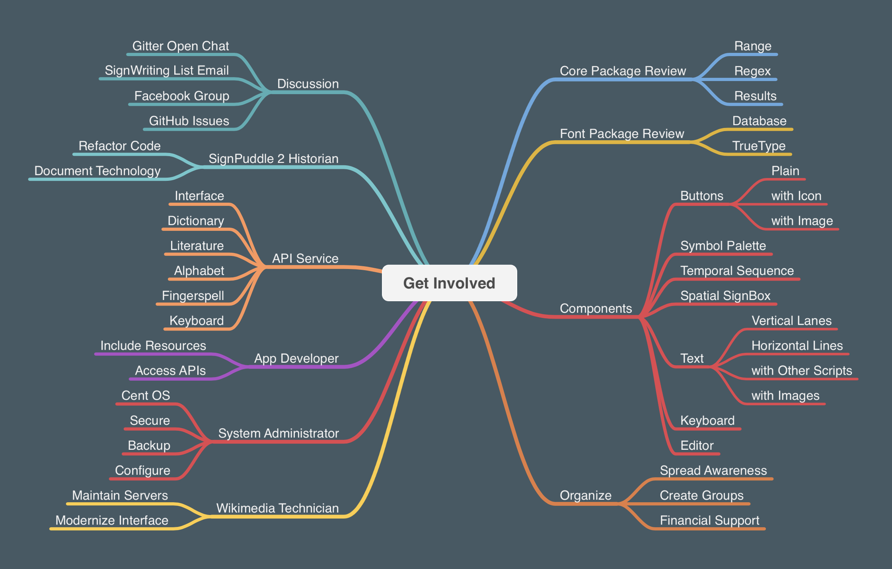

# @sutton-signwriting/get-involved

There are many ways to get involved with Sutton SignWriting.

> Author: https://SteveSlevinski.me  
> Channel: https://www.youtube.com/channel/UCXu4AXlG0rXFtk_5SzumDow  
> Support: https://www.patreon.com/signwriting  

## Discussion
There are several places online to have discussions about Sutton SignWriting.
- Gitter Open Chat: https://gitter.im/sutton-signwriting/community
- SignWriting List Email: https://www.signwriting.org/forums/swlist/
- Facebook Group: https://www.facebook.com/groups/SuttonSignWriting/

If you would like to get involved, consider opening an issue in the get involved repository.
- GitHub Issues: https://github.com/Sutton-signwriting/get-involved/issues

## SignPuddle 2 Historian
SignPuddle 2 continues to be useful.
The code has been open sources.
Several sections of the code need to be updated before the move to the new server.
- Refactor Code: https://github.com/Slevinski/SignPuddle2

The technology behind SignWriting is extensively documented.
It would be helpful to have this documentation reviewed, expanded, and reorganized to be more complete and easier to use.
- Internet Draft: https://tools.ietf.org/html/draft-slevinski-formal-signwriting-07
- Sutton SignWriting Project: https://slevinski.github.io/SuttonSignWriting/

## API Service
Some API services are available with past and present software packages.
The API services need to be redesigned with a solid design and code base.
The Symfony PHP Framework is a possible platform.
It will include services to read and write collections of several types.
- Interface
- Dictionary
- Literature
- Alphabet
- Fingerspell
- Keyboard

## App Developer
The more apps the better.
There are many freely available resources you can include in your project.
Existing and future APIs will help you expand the functionality and impact of you Apps.
- Include Resources
- Access API

## System Administrator
The SignWriting server upgrade of 2020 is currently under way.
We are upgrading to Cent OS.
If you are an experience system administrator, consider donating your time to help keep the SignWriting server up and running.
- Secure
- Backup
- Configure

## Wikimedia Technician
The Wikimedia movement is in need of volunteers.
There are two SignWriting servers that need maintained.
The user interface needs to be modernized.
You can find all of the information needed on IdeaLab.
- https://meta.wikimedia.org/wiki/Grants:IdeaLab/The_SignWriting_Team_and_Written_Sign_Language_Projects#MediaWiki_Software

## Core Package Review
The Sutton SignWriting Core package needs to be reviewed.
There are six functions that need to be rewritten:
fswquery.range, fswquery.regex, fswquery.results, swuquery.range, swuquery.regex, swuquery.results.
- https://github.com/sutton-signwriting/core

## Font Packages Review
The Sutton SignWriting font packages need to be reviewed.
- Database for Node: https://github.com/sutton-signwriting/font-db
- TrueType for Browser: https://github.com/sutton-signwriting/font-ttf

## Components
Reusable components are the next stage of development.
Various technologies are being considered.
- Buttons (plain, with icon, with image)
- Symbol
- Symbol Palette
- Temporal Sequence
- Spatial SignBox
- Text  
- - Vertical Lanes
- - Horizontal Lines
- - with Other Scripts
- - with Images
- Keyboard
- Editor

## Organize
- Spread Awareness
- Create Groups
- Financial Support

## License
CC0

